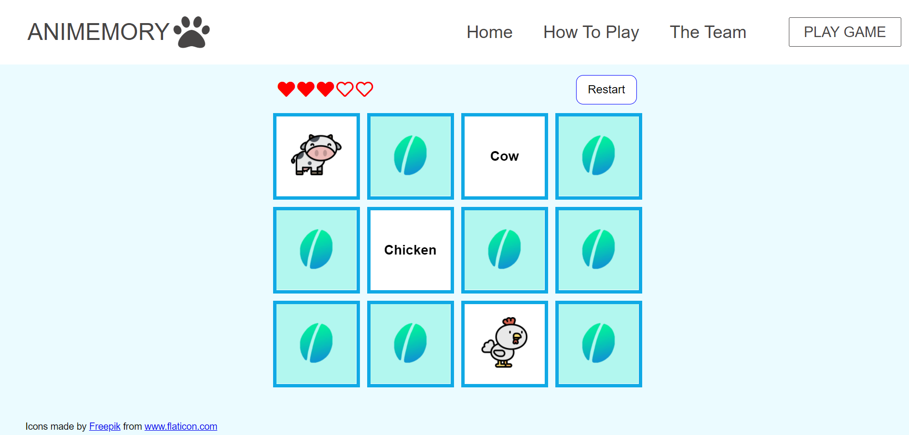

# Animemory

This is a memory card game to help young children improve their visual recognition, short-term memory, and attention skills. Players must match the animal picture to the text in a certain amount of tries.

Technologies used: React

## How to run
- Clone repository: `git clone https://github.com/fidwu/Animemory.git`
- Install packages using `yarn`
- Run `yarn start`

## Live Demo
https://animemory.netlify.app/

## Screenshots

## Developers
Fidella Wu

[GitHub](http://github.com/fidwu) | [LinkedIn](https://www.linkedin.com/in/fidella-w-23b90520b/)

Susana Marquina

[GitHub](http://github.com/smarquina37) | [LinkedIn](https://www.linkedin.com/in/smarquina)
